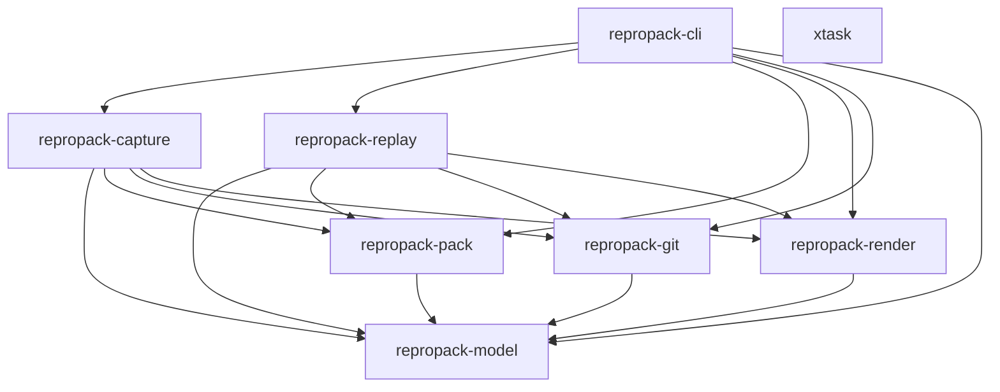

# Design Document — ReproPack v0.2 Alpha

## Overview

ReproPack v0.2 alpha hardens the v0.1 scaffold into a compile-checked, testable CLI by closing five priority gaps:

1. **Pre/post-run capture model** — record Git state before and after the predicate command, compute an explicit delta.
2. **Replay environment discipline** — start replay from an empty env baseline instead of inheriting the host, classify every variable in the receipt.
3. **Artifact comparison beyond exit code** — SHA-256 digests for stdout, stderr, and output artifacts; same-exit-different-evidence detection.
4. **Schema and integrity hardening** — JSON Schema validation at read time, a detached integrity envelope, configurable size caps with truncation records.
5. **Real test surface** — temp-repo integration tests, pack/unpack property tests, serde round-trips, CLI smoke tests, malformed packet rejection, replay drift comparison.

All changes are additive to the v1 schema (`repropack.manifest.v1` / `repropack.receipt.v1`). No breaking version bump is required.

### Design Principles

- Start from the packet contract, not from helper functions (AGENTS.md rule 1).
- Prefer adding fields to the manifest or receipt over inventing side channels (AGENTS.md rule 2).
- Keep replay honest — missing context becomes structured drift, not a false success claim (AGENTS.md rule 6).
- Treat packets as untrusted input — validate schema and integrity on every read.
- `repropack-model` has zero dependencies on application crates.

## Architecture

The existing crate dependency graph is preserved. No new crates are introduced.



### Change Distribution by Crate

| Crate | v0.2 Changes |
|---|---|
| `repropack-model` | New fields on `GitState`, `ExecutionRecord`, `ReplayReceipt`; new structs `GitSnapshot`, `CaptureDelta`, `EnvClassification`, `IntegrityEntry`; schema validation via `jsonschema` crate |
| `repropack-pack` | Integrity envelope verification in `materialize`; `sha256_bytes` helper |
| `repropack-git` | `capture_git_snapshot` function for pre/post snapshots; delta computation |
| `repropack-capture` | Pre/post capture orchestration; evidence digests; size caps; integrity envelope generation |
| `repropack-replay` | Minimal env baseline; env classification; stdout/stderr/output digest comparison; capture delta drift; `--inherit-env` flag |
| `repropack-render` | Render new receipt fields (env classification, matched_outputs, evidence drift) |
| `repropack-cli` | `--inherit-env` flag on replay; `--max-file-size` / `--max-packet-size` on capture |
| `xtask` | No changes |

### New Workspace Dependencies

| Crate | Purpose |
|---|---|
| `jsonschema` | JSON Schema draft 2020-12 validation for manifest and receipt read paths |
| `proptest` | Property-based testing for serde round-trips and pack/unpack determinism |

These are added to `[workspace.dependencies]` in the root `Cargo.toml`. `jsonschema` becomes a dependency of `repropack-model`. `proptest` is a `[dev-dependencies]` entry on `repropack-model`, `repropack-pack`, and integration test crates.

## Components and Interfaces

### 1. repropack-model — Packet and Receipt Truth

#### New Types

```rust
/// A point-in-time Git snapshot (used for both pre-run and post-run).
#[derive(Clone, Debug, Serialize, Deserialize, PartialEq, Eq)]
pub struct GitSnapshot {
    pub commit_sha: Option<String>,
    pub is_dirty: bool,
    pub changed_paths: Vec<String>,
    pub untracked_paths: Vec<String>,
    pub worktree_patch_path: Option<String>,
}

/// The diff between pre-run and post-run Git state.
#[derive(Clone, Debug, Serialize, Deserialize, PartialEq, Eq)]
pub struct CaptureDelta {
    pub newly_dirty_paths: Vec<String>,
    pub newly_modified_paths: Vec<String>,
    pub newly_untracked_paths: Vec<String>,
}

/// Environment variable classification in the replay receipt.
#[derive(Clone, Debug, Serialize, Deserialize, PartialEq, Eq)]
pub struct EnvClassification {
    pub restored: Vec<String>,
    pub overridden: Vec<String>,
    pub inherited: Vec<String>,
}

/// A single entry in the integrity envelope.
#[derive(Clone, Debug, Serialize, Deserialize, PartialEq, Eq)]
pub struct IntegrityEntry {
    pub relative_path: String,
    pub sha256: String,
    pub size_bytes: u64,
}

/// Size cap configuration for capture.
#[derive(Clone, Debug, Serialize, Deserialize)]
pub struct SizeCaps {
    pub max_file_bytes: u64,     // default 50 MiB
    pub max_packet_bytes: u64,   // default 500 MiB
}

impl Default for SizeCaps {
    fn default() -> Self {
        Self {
            max_file_bytes: 50 * 1024 * 1024,
            max_packet_bytes: 500 * 1024 * 1024,
        }
    }
}
```

#### Modified Types

**`GitState`** — add three optional fields:

```rust
pub struct GitState {
    // ... existing fields unchanged ...
    pub git_pre: Option<GitSnapshot>,
    pub git_post: Option<GitSnapshot>,
    pub capture_delta: Option<CaptureDelta>,
}
```

`git_pre`, `git_post`, and `capture_delta` default to `None` via `#[serde(default)]`, preserving backward compatibility with v0.1 packets.

**`ExecutionRecord`** — add evidence digests:

```rust
pub struct ExecutionRecord {
    // ... existing fields unchanged ...
    pub stdout_sha256: Option<String>,
    pub stderr_sha256: Option<String>,
}
```

**`ReplayReceipt`** — add env classification and output matching:

```rust
pub struct ReplayReceipt {
    // ... existing fields unchanged ...
    pub env_classification: Option<EnvClassification>,
    pub matched_outputs: Option<bool>,
}
```

All new fields use `Option` with `#[serde(default, skip_serializing_if = "Option::is_none")]` so that v0.1 JSON round-trips cleanly.

#### Schema Validation

Add a `validate` module to `repropack-model`:

```rust
pub mod validate {
    use jsonschema::JSONSchema;
    use serde_json::Value;

    /// Validate a JSON value against the manifest schema.
    /// The schema is embedded at compile time via include_str!.
    pub fn validate_manifest(json: &Value) -> Result<(), ValidationError>;

    /// Validate a JSON value against the receipt schema.
    pub fn validate_receipt(json: &Value) -> Result<(), ValidationError>;

    pub struct ValidationError {
        pub path: String,
        pub message: String,
    }
}
```

The JSON Schema files are embedded using `include_str!("../../schema/manifest-v1.schema.json")` so that validation works without filesystem access at runtime. `PacketManifest::read_from_path` and `ReplayReceipt::read_from_path` call the validator before `serde_json::from_slice`. Schema version mismatch is caught by the `const` constraint on `schema_version` in the schema itself.

### 2. repropack-pack — Archive Transport and Integrity

#### Integrity Envelope Verification

```rust
/// Verify all files in a materialized packet against integrity.json.
/// Returns Ok(()) if all digests match, or Err identifying the first mismatch.
pub fn verify_integrity(packet_root: &Path) -> Result<()>;

/// Compute SHA-256 of a byte slice (for stdout/stderr in memory).
pub fn sha256_bytes(data: &[u8]) -> String;
```

The `materialize` function is updated:
1. After unpacking, check if `integrity.json` exists in the packet root.
2. If present, call `verify_integrity`. On mismatch, return an error with the file path, expected digest, and observed digest.
3. If absent, proceed without verification (log a warning note via the return type).

### 3. repropack-git — Repo Inspection

#### Git Snapshot Capture

```rust
/// Capture a point-in-time Git snapshot (commit, dirty status, paths, optional worktree patch).
/// Used for both pre-run and post-run snapshots.
pub fn capture_git_snapshot(
    repo_root: &Path,
    out_dir: &Path,
    label: &str,  // "pre" or "post"
) -> Result<GitSnapshotOutcome>;

pub struct GitSnapshotOutcome {
    pub snapshot: GitSnapshot,
    pub omissions: Vec<Omission>,
}

/// Compute the delta between two snapshots.
pub fn compute_capture_delta(pre: &GitSnapshot, post: &GitSnapshot) -> CaptureDelta;
```

`capture_git_snapshot` calls `git status --porcelain`, `git diff --name-only HEAD`, and `git ls-files --others --exclude-standard`. It writes a worktree patch to `git/{label}-worktree.patch` if the tree is dirty. The existing `capture_git_state` function remains for bundle/diff/ref capture; the snapshot functions are additive.

`compute_capture_delta` performs set differences:
- `newly_dirty_paths` = paths in post's changed_paths not in pre's changed_paths
- `newly_modified_paths` = paths dirty in both but with different worktree patch content (approximated by presence in both changed_paths sets)
- `newly_untracked_paths` = paths in post's untracked_paths not in pre's untracked_paths

### 4. repropack-capture — Capture Flow Orchestration

#### Updated Capture Flow

```text
1. discover repo root
2. capture_git_snapshot(pre)          ← NEW
3. capture_git_state (bundle, diff, ref)
4. run predicate command
5. capture_git_snapshot(post)          ← NEW
6. compute_capture_delta(pre, post)    ← NEW
7. compute stdout/stderr digests       ← NEW
8. collect inputs/outputs (with size caps) ← MODIFIED
9. generate integrity.json             ← NEW
10. assemble manifest
11. pack
```

**Size Caps**: `collect_indexed_files` is modified to accept `SizeCaps`. Before copying a file into the packet staging directory:
- If the file exceeds `max_file_bytes`, truncate to `max_file_bytes` and record a `Truncation_Record` omission.
- Track cumulative packet size. If adding the next file would exceed `max_packet_bytes`, skip it and record an omission with kind `packet_size_exceeded`.

**Integrity Envelope**: After all files are staged but before writing `manifest.json`, iterate the staging directory, compute SHA-256 and size for every file (including `manifest.json` once written), and write `integrity.json`. The envelope excludes itself.

**CaptureOptions** gains:

```rust
pub struct CaptureOptions {
    // ... existing fields ...
    pub size_caps: SizeCaps,
}
```

### 5. repropack-replay — Replay Flow Orchestration

#### Minimal Environment Baseline

The current replay code inherits the full host environment:

```rust
// v0.1 (current)
for (key, value) in std::env::vars() {
    command.env(&key, value);
}
```

v0.2 replaces this with:

```rust
// v0.2
command.env_clear();
for (key, value) in &manifest.environment.allowed_vars {
    command.env(key, value);
}
for (key, value) in &options.set_env {
    command.env(key, value);
}
```

When `--inherit-env` is passed, the old behavior is restored and a drift item with subject `env_inherited` and severity `warning` is recorded.

#### Environment Classification

After building the command environment, the replay engine classifies each variable:
- `restored`: keys from `manifest.environment.allowed_vars` not overridden by `--set-env`
- `overridden`: keys present in both manifest and `--set-env` (set-env wins)
- `inherited`: keys from host env when `--inherit-env` is active

The classification is written to `receipt.env_classification`.

#### Evidence Digest Comparison

After command execution:
1. Compute SHA-256 of observed stdout and stderr.
2. Compare against `manifest.execution.stdout_sha256` and `stderr_sha256`.
3. For each mismatch, add a `DriftItem` with subject `stdout_digest` or `stderr_digest`.
4. For each output in `manifest.outputs`, recompute the digest at `restore_path`. Missing files get `output_missing:<path>` drift. Mismatched digests get `output_digest:<path>` drift.
5. Set `receipt.matched_outputs` to true only if all output digests match and none are missing.

#### Same-Exit-Different-Evidence

After exit code comparison:
- If exit codes match but any evidence digest (stdout, stderr, output) diverges, set `receipt.status = Mismatched` and add note "exit code matched but evidence diverged".
- `receipt.matched` is true only when exit code matches AND all evidence digests match.

#### Capture Delta Drift

If the manifest contains a `capture_delta`:
1. Capture pre-run snapshot in the replay workdir.
2. Run the command.
3. Capture post-run snapshot.
4. Compute replay delta.
5. Compare replay delta against manifest's capture_delta. If they differ, add a drift item with subject `capture_delta`.

**ReplayOptions** gains:

```rust
pub struct ReplayOptions {
    // ... existing fields ...
    pub inherit_env: bool,
}
```

### 6. repropack-render — Human-Facing Summaries

`render_receipt_markdown` is extended to render:
- `env_classification` section showing restored/overridden/inherited counts and keys
- `matched_outputs` status
- Evidence digest drift items (already handled by existing drift rendering)

### 7. repropack-cli — Operator Surface

**Replay subcommand** gains `--inherit-env` flag:

```rust
#[arg(long)]
inherit_env: bool,
```

**Capture subcommand** gains size cap flags:

```rust
#[arg(long, default_value = "52428800")]
max_file_size: u64,

#[arg(long, default_value = "524288000")]
max_packet_size: u64,
```

### 8. JSON Schema Updates

Both schemas remain at `repropack.manifest.v1` and `repropack.receipt.v1` (additive changes only).

**manifest-v1.schema.json** additions:
- `gitState.$defs` gains `gitSnapshot` and `captureDelta` definitions
- `gitState.properties` gains optional `git_pre`, `git_post`, `capture_delta`
- `execution.properties` gains optional `stdout_sha256`, `stderr_sha256`

**receipt-v1.schema.json** additions:
- `$defs` gains `envClassification` definition
- Root properties gain optional `env_classification`, `matched_outputs`

## Data Models

### Manifest v0.2 Field Map

```json
{
  "schema_version": "repropack.manifest.v1",
  "packet_id": "...",
  "packet_name": "...",
  "created_at": "...",
  "capture_level": "repo",
  "replay_fidelity": "exact",
  "replay_policy": "safe",
  "command": { "..." },
  "execution": {
    "started_at": "...",
    "finished_at": "...",
    "duration_ms": 15000,
    "exit_code": 101,
    "signal": null,
    "success": false,
    "spawn_error": null,
    "stdout_sha256": "a1b2c3...",
    "stderr_sha256": "d4e5f6..."
  },
  "git": {
    "commit_sha": "abc123",
    "ref_name": "main",
    "base": null,
    "head": null,
    "is_dirty": false,
    "changed_paths": [],
    "untracked_paths": [],
    "bundle_path": "git/repo.bundle",
    "diff_path": null,
    "worktree_patch_path": null,
    "git_pre": {
      "commit_sha": "abc123",
      "is_dirty": false,
      "changed_paths": [],
      "untracked_paths": [],
      "worktree_patch_path": null
    },
    "git_post": {
      "commit_sha": "abc123",
      "is_dirty": true,
      "changed_paths": ["src/lib.rs"],
      "untracked_paths": ["target/debug/test-output.txt"],
      "worktree_patch_path": "git/post-worktree.patch"
    },
    "capture_delta": {
      "newly_dirty_paths": ["src/lib.rs"],
      "newly_modified_paths": [],
      "newly_untracked_paths": ["target/debug/test-output.txt"]
    }
  },
  "environment": { "..." },
  "inputs": [],
  "outputs": [],
  "packet_files": [],
  "omissions": [],
  "notes": []
}
```

### Receipt v0.2 Field Map

```json
{
  "schema_version": "repropack.receipt.v1",
  "packet_id": "...",
  "replayed_at": "...",
  "workdir": "...",
  "command_display": "cargo test",
  "status": "mismatched",
  "recorded_exit_code": 101,
  "observed_exit_code": 101,
  "matched": false,
  "matched_outputs": false,
  "env_classification": {
    "restored": ["CI", "CARGO_HOME"],
    "overridden": ["RUST_LOG"],
    "inherited": []
  },
  "drift": [
    {
      "subject": "stdout_digest",
      "expected": "a1b2c3...",
      "observed": "x7y8z9...",
      "severity": "warning"
    },
    {
      "subject": "output_missing:outputs/files/result.bin",
      "expected": "present",
      "observed": "missing",
      "severity": "error"
    }
  ],
  "notes": ["exit code matched but evidence diverged"],
  "stdout_path": ".repropack-replay/stdout.log",
  "stderr_path": ".repropack-replay/stderr.log"
}
```

### Integrity Envelope

```json
[
  {
    "relative_path": "exec/argv.json",
    "sha256": "...",
    "size_bytes": 142
  },
  {
    "relative_path": "exec/stdout.log",
    "sha256": "...",
    "size_bytes": 8192
  }
]
```

Written to `integrity.json` at the packet root. Excludes itself. Verified by `repropack-pack::verify_integrity` during `materialize`.

### Packet Layout v0.2

```text
packet.rpk
├── manifest.json
├── integrity.json                    ← NEW
├── summary.md
├── summary.html
├── git/
│   ├── commit.json
│   ├── changed-paths.txt
│   ├── diff.patch
│   ├── worktree.patch
│   ├── pre-worktree.patch            ← NEW (if pre-run dirty)
│   ├── post-worktree.patch           ← NEW (if post-run dirty)
│   ├── capture-delta.json            ← NEW
│   └── repo.bundle
├── exec/
│   ├── argv.json
│   ├── exit.json
│   ├── stdout.log
│   └── stderr.log
├── env/
│   ├── platform.json
│   ├── keys.json
│   ├── allowed-values.json
│   └── tool-versions.json
├── inputs/
│   ├── index.json
│   └── files/...
└── outputs/
    ├── index.json
    └── files/...
```


## Correctness Properties

*A property is a characteristic or behavior that should hold true across all valid executions of a system — essentially, a formal statement about what the system should do. Properties serve as the bridge between human-readable specifications and machine-verifiable correctness guarantees.*

### Property 1: Capture delta is correct set difference

*For any* two `GitSnapshot` values (pre and post), `compute_capture_delta(pre, post)` shall produce a `CaptureDelta` where `newly_dirty_paths` equals the set of paths in `post.changed_paths` that are not in `pre.changed_paths`, `newly_untracked_paths` equals the set of paths in `post.untracked_paths` that are not in `pre.untracked_paths`, and `newly_modified_paths` equals the set of paths present in both `pre.changed_paths` and `post.changed_paths`.

**Validates: Requirements 3.1**

### Property 2: Replay environment baseline contains only declared variables

*For any* `PacketManifest` with an `allowed_vars` map and any `set_env` override map, when replay constructs the command environment without `--inherit-env`, the resulting environment shall contain exactly the union of `allowed_vars` keys and `set_env` keys, with `set_env` values taking precedence for keys present in both.

**Validates: Requirements 4.1, 4.2, 4.3**

### Property 3: Environment classification is a disjoint partition

*For any* replay producing an `EnvClassification`, the `restored`, `overridden`, and `inherited` arrays shall be pairwise disjoint, and their union shall equal the complete set of environment variable keys injected into the replay command. A key present in both the manifest `allowed_vars` and `--set-env` shall appear in `overridden` and not in `restored`.

**Validates: Requirements 5.1, 5.2**

### Property 4: Evidence digest mismatch produces drift

*For any* pair of byte sequences where `sha256(a) != sha256(b)`, when the manifest records digest `sha256(a)` for an evidence channel (stdout, stderr, or output artifact) and replay observes content `b`, the receipt shall contain a `DriftItem` whose subject identifies that channel and whose `expected` and `observed` fields carry the respective digests.

**Validates: Requirements 6.3, 6.4, 7.2**

### Property 5: matched_outputs is the conjunction of all output comparisons

*For any* set of recorded output files and their replay-observed counterparts, `matched_outputs` shall be `true` if and only if every recorded output file is present after replay and its SHA-256 digest matches the recorded digest.

**Validates: Requirements 7.4**

### Property 6: Receipt matched equals exit code match AND evidence match

*For any* replay result, `receipt.matched` shall be `true` if and only if `observed_exit_code == recorded_exit_code` and all evidence digests (stdout, stderr, and every output artifact) match. When exit codes match but at least one evidence digest differs, `receipt.status` shall be `mismatched`.

**Validates: Requirements 8.1, 8.2**

### Property 7: Schema validation rejects non-conforming JSON

*For any* JSON object that violates the manifest or receipt JSON Schema (wrong `schema_version`, missing required field, wrong field type), `PacketManifest::read_from_path` or `ReplayReceipt::read_from_path` shall return an error containing the validation failure path.

**Validates: Requirements 9.1, 9.2, 9.4, 17.2, 17.3**

### Property 8: Integrity envelope lists all packet files except itself

*For any* packet directory, the `integrity.json` file shall contain one entry for every file in the directory except `integrity.json` itself, and each entry's `sha256` and `size_bytes` shall match the actual file on disk.

**Validates: Requirements 10.1**

### Property 9: Integrity mismatch is rejected on materialize

*For any* packet containing an `integrity.json` where at least one entry's `sha256` does not match the actual file content, `materialize` shall return an error identifying the mismatched file, the expected digest, and the observed digest.

**Validates: Requirements 10.3, 17.4**

### Property 10: Per-file size cap truncates and records omission

*For any* artifact whose size exceeds the configured per-file `Size_Cap`, the Capture_Engine shall write at most `Size_Cap` bytes to the packet and record an `Omission` with kind `truncated` containing the original size and the retained size.

**Validates: Requirements 11.1, 11.2**

### Property 11: Total packet size cap stops capture and records omission

*For any* collection of artifacts whose cumulative size would exceed the configured total `Size_Cap`, the Capture_Engine shall stop capturing additional artifacts and record an `Omission` with kind `packet_size_exceeded`.

**Validates: Requirements 11.3, 11.4**

### Property 12: Manifest serde round-trip and schema conformance

*For any* valid `PacketManifest` value, serializing to JSON then deserializing shall produce a value equal to the original, and the serialized JSON shall validate against `manifest-v1.schema.json` without errors.

**Validates: Requirements 12.4, 15.1, 15.3**

### Property 13: Receipt serde round-trip and schema conformance

*For any* valid `ReplayReceipt` value, serializing to JSON then deserializing shall produce a value equal to the original, and the serialized JSON shall validate against `receipt-v1.schema.json` without errors.

**Validates: Requirements 12.5, 15.2, 15.4**

### Property 14: Pack/unpack round-trip preserves all file contents

*For any* directory tree containing files with arbitrary byte contents, packing with `pack_dir` then unpacking with `unpack_rpk` shall produce a directory tree with identical relative paths and identical file contents (verified by SHA-256 digest comparison).

**Validates: Requirements 14.1, 14.2**

### Property 15: Pack determinism

*For any* directory tree, packing the same source directory twice shall produce archives with identical byte content.

**Validates: Requirements 14.3**

### Property 16: Path traversal rejection

*For any* tar archive entry whose path contains a parent-directory component (`..`), `unpack_rpk` shall return an error and shall not write any file outside the target directory.

**Validates: Requirements 17.1**

### Property 17: Capture delta drift comparison

*For any* two `CaptureDelta` values where at least one field differs, the replay engine's delta comparison shall produce a `DriftItem` with subject `capture_delta` and severity `warning`.

**Validates: Requirements 18.2**

## Error Handling

### Capture Errors

| Condition | Behavior | Evidence |
|---|---|---|
| Pre-run git snapshot fails | Record `Omission(kind: "git_pre")`, continue capture | Omission in manifest |
| Post-run git snapshot fails | Record `Omission(kind: "git_post")`, continue capture | Omission in manifest |
| Delta computation impossible (missing pre or post) | Record `Omission(kind: "capture_delta")`, omit delta | Omission in manifest |
| Artifact exceeds per-file size cap | Truncate to cap, record `Omission(kind: "truncated", original_size, retained_size)` | Omission in manifest |
| Total packet size exceeded | Stop capturing, record `Omission(kind: "packet_size_exceeded")` | Omission in manifest |
| Integrity envelope generation fails | Fatal error — packet is not written | `anyhow::Error` propagated |
| Schema validation of own manifest fails | Fatal error — indicates a bug in model serialization | `anyhow::Error` propagated |

### Replay Errors

| Condition | Behavior | Evidence |
|---|---|---|
| Schema validation of manifest fails | Return error before any replay work | `anyhow::Error` with validation path |
| Integrity verification fails | Return error before any replay work | `anyhow::Error` with file path and digest mismatch |
| Unrecognized schema_version | Return error | `anyhow::Error` |
| Evidence digest mismatch (stdout/stderr/output) | Record `DriftItem`, set status to `mismatched` if exit codes matched | Drift items in receipt |
| Output file missing after replay | Record `DriftItem(severity: error)`, set `matched_outputs = false` | Drift item in receipt |
| Capture delta differs | Record `DriftItem(subject: "capture_delta", severity: warning)` | Drift item in receipt |
| `--inherit-env` used | Record `DriftItem(subject: "env_inherited", severity: warning)` | Drift item in receipt |

### Pack/Unpack Errors

| Condition | Behavior | Evidence |
|---|---|---|
| Path traversal in archive | Return error, write nothing | `anyhow::Error` |
| Integrity.json absent | Proceed without verification, note in return value | Warning-level note |
| Integrity.json digest mismatch | Return error with file path, expected, observed | `anyhow::Error` |

## Testing Strategy

### Property-Based Testing

Library: **`proptest`** (Rust ecosystem standard for property-based testing).

Added as `[dev-dependencies]` to `repropack-model`, `repropack-pack`, and a new `tests/` integration test crate.

Each property test runs a minimum of **100 iterations** (configured via `proptest::test_runner::Config`).

Each test is tagged with a comment referencing the design property:

```rust
// Feature: repropack-v02-alpha, Property 12: Manifest serde round-trip and schema conformance
proptest! {
    #[test]
    fn manifest_serde_round_trip(manifest in arb_packet_manifest()) {
        let json = serde_json::to_vec_pretty(&manifest).unwrap();
        let reparsed: PacketManifest = serde_json::from_slice(&json).unwrap();
        prop_assert_eq!(manifest, reparsed);
        // also validate against schema
        let value: serde_json::Value = serde_json::from_slice(&json).unwrap();
        prop_assert!(validate::validate_manifest(&value).is_ok());
    }
}
```

#### Property Test Placement

| Property | Crate | Test Module |
|---|---|---|
| P1: Capture delta correctness | `repropack-git` | `tests/delta_props.rs` |
| P2: Replay env baseline | `repropack-replay` | `tests/env_props.rs` |
| P3: Env classification partition | `repropack-replay` | `tests/env_props.rs` |
| P4: Evidence digest drift | `repropack-replay` | `tests/evidence_props.rs` |
| P5: matched_outputs conjunction | `repropack-replay` | `tests/evidence_props.rs` |
| P6: matched = exit AND evidence | `repropack-replay` | `tests/evidence_props.rs` |
| P7: Schema rejects invalid JSON | `repropack-model` | `tests/schema_props.rs` |
| P8: Integrity envelope completeness | `repropack-pack` | `tests/integrity_props.rs` |
| P9: Integrity mismatch rejection | `repropack-pack` | `tests/integrity_props.rs` |
| P10: Per-file size cap | `repropack-capture` | `tests/size_cap_props.rs` |
| P11: Total packet size cap | `repropack-capture` | `tests/size_cap_props.rs` |
| P12: Manifest serde round-trip | `repropack-model` | `tests/serde_props.rs` |
| P13: Receipt serde round-trip | `repropack-model` | `tests/serde_props.rs` |
| P14: Pack/unpack round-trip | `repropack-pack` | `tests/pack_props.rs` |
| P15: Pack determinism | `repropack-pack` | `tests/pack_props.rs` |
| P16: Path traversal rejection | `repropack-pack` | `tests/pack_props.rs` |
| P17: Capture delta drift | `repropack-replay` | `tests/delta_drift_props.rs` |

#### Generators (proptest Arbitrary implementations)

Key generators needed:

- `arb_packet_manifest()` — generates valid `PacketManifest` with all v0.2 fields populated randomly
- `arb_replay_receipt()` — generates valid `ReplayReceipt` with env_classification and matched_outputs
- `arb_git_snapshot()` — generates `GitSnapshot` with random paths and dirty status
- `arb_capture_delta()` — generates `CaptureDelta` with random path sets
- `arb_directory_tree()` — generates a `TempDir` with random files of random byte content (for pack/unpack tests)
- `arb_env_vars()` — generates `BTreeMap<String, String>` for environment variable testing
- `arb_indexed_file()` — generates `IndexedFile` with valid SHA-256 digests

These generators live in a shared `test-support` module or in each crate's `tests/` directory.

### Unit Tests (Examples and Edge Cases)

| Test | Crate | Validates |
|---|---|---|
| Pre-run snapshot captured before command | `repropack-capture` integration | Req 1.1 |
| Post-run snapshot reflects command changes | `repropack-capture` integration | Req 2.1 |
| capture-delta.json written to packet | `repropack-capture` integration | Req 3.3 |
| Missing pre-run produces git_pre omission | `repropack-capture` | Req 1.3 |
| Missing post-run produces git_post omission | `repropack-capture` | Req 2.3 |
| Missing pre or post omits delta with omission | `repropack-capture` | Req 3.4 |
| --inherit-env records drift warning | `repropack-replay` | Req 4.5 |
| Excluded host vars recorded as info drift | `repropack-replay` | Req 4.4 |
| Stdout/stderr digests stored in manifest | `repropack-capture` integration | Req 6.1, 6.2 |
| Missing output file produces error drift | `repropack-replay` | Req 7.3 |
| integrity.json absent → proceed with warning | `repropack-pack` | Req 10.4 |
| No capture_delta → no drift item | `repropack-replay` | Req 18.3 |
| Schema validation error includes path | `repropack-model` | Req 9.3 |

### Integration Tests (Scenario Suite)

| Scenario | Validates |
|---|---|
| Capture clean commit failure → assert manifest commit SHA, exit code, changed paths | Req 13.1 |
| Capture + replay → assert receipt.matched = true, drift empty | Req 13.2 |
| Capture + modified env replay → assert drift items present | Req 13.3 |
| Capture with outputs + modified output replay → assert matched_outputs = false | Req 13.4 |
| Capture with pre/post delta + replay → assert delta drift comparison | Req 18.1 |

### CLI Smoke Tests

| Test | Validates |
|---|---|
| `repropack --help` exits 0, contains "capture", "inspect", "replay", "unpack" | Req 16.1 |
| `repropack capture --help` exits 0 | Req 16.2 |
| `repropack inspect <valid-packet>` exits 0, output contains packet ID | Req 16.3 |
| `repropack capture` (no command) exits non-zero with error message | Req 16.4 |

### Test Execution

All tests run via:

```bash
cargo xtask ci-fast    # unit + property tests
cargo xtask ci-full    # above + integration + CLI smoke tests
```

Property tests use `proptest` with default config (256 cases) bumped to minimum 100 via explicit config where needed. Each property test references its design property number in a comment tag:

```
// Feature: repropack-v02-alpha, Property N: <property title>
```
