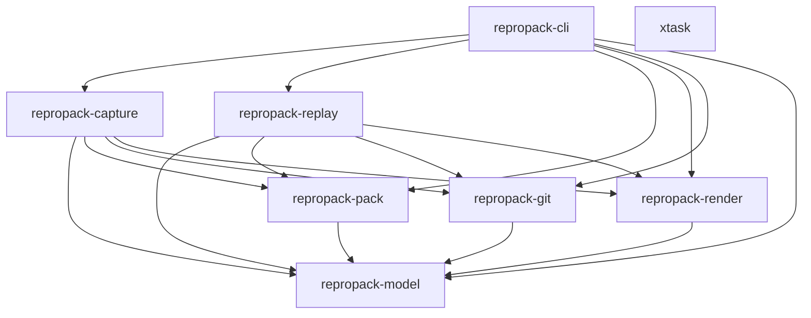

# Design Document — ReproPack v0.3 Beta

## Overview

ReproPack v0.3 beta graduates the v0.2 alpha into a tool that delivers on its core promise: a captured failure packet that replays cleanly, explains itself to operators, and can be safely shared externally. The release is organized into five priority tiers:

1. **Replay cleanliness fixes** — eliminate false-positive drift caused by the replay engine's own log files contaminating delta computation, handle root-commit bundle creation, collapse env-excluded noise, normalize tool version strings, and demonstrate an end-to-end `matched == true` happy path.
2. **Operator diagnostic surfaces** — `doctor` (packet health assessment), `explain` (human-readable drift translation), `shell` (interactive exploration of packet state).
3. **Scrub engine** — `scrub --public` produces a redacted packet safe for external sharing, with a machine-readable redaction report and regenerated integrity envelope.
4. **CI bridge** — `fetch gh` downloads packet artifacts from GitHub Actions runs; `gh summarize` renders triage summaries for `$GITHUB_STEP_SUMMARY`.
5. **Configuration and profiles** — `.repropack.toml` with named profiles (`ci`, `local`, `triage`), `config show` pretty-printer, and `--profile` flag.

All changes remain additive to the v1 schema (`repropack.manifest.v1` / `repropack.receipt.v1`). No breaking version bump is required.

### Design Principles

- Start from the packet contract, not from helper functions (AGENTS.md rule 1).
- Prefer adding fields to the manifest or receipt over inventing side channels (AGENTS.md rule 2).
- Keep replay honest — missing context becomes structured drift, not a false success claim (AGENTS.md rule 6).
- Treat packets as untrusted input — validate schema and integrity on every read.
- `repropack-model` has zero dependencies on application crates.
- No new crates unless absolutely necessary. All v0.3 work fits into the existing eight-crate workspace.

## Architecture

The existing crate dependency graph is preserved. No new crates are introduced.



### Change Distribution by Crate

| Crate | v0.3 Changes |
|---|---|
| `repropack-model` | New types: `RedactionEntry`, `DoctorReport`, `DoctorReadiness`, `RepropackConfig`, `ProfileConfig`; new optional fields on `ReplayReceipt` (`env_excluded_keys`) and `PacketManifest` (`redaction_report_path`); version normalization helper; config serde types |
| `repropack-pack` | No structural changes; existing `materialize`, `verify_integrity`, `sha256_bytes` reused by scrub engine |
| `repropack-git` | `capture_git_snapshot` gains path exclusion support (for `.repropack-replay/`); `git bundle create --all` fallback for root commits |
| `repropack-render` | `render_doctor_report`, `render_explain_output`, `render_gh_summary` functions; env-excluded summary rendering; verbose vs. summary mode |
| `repropack-capture` | Bundle creation retry with `--all` fallback; default packet naming (`repropack-<short-sha>-<timestamp>`); config-file-aware defaults |
| `repropack-replay` | Replay support dir exclusion from git status; env-excluded drift collapse to summary; tool version normalization; `--verbose` flag support |
| `repropack-cli` | New subcommands: `doctor`, `explain`, `shell`, `scrub`, `fetch gh`, `gh summarize`, `config show`; global `--verbose` and `--profile` flags; `.repropack.toml` discovery and parsing |
| `xtask` | No changes |

### New Workspace Dependencies

| Crate | Purpose | Used By |
|---|---|---|
| `toml` | TOML parsing and serialization for `.repropack.toml` | `repropack-model` (config types), `repropack-cli` |
| `reqwest` (blocking, rustls-tls) | GitHub API HTTP client for `fetch gh` | `repropack-cli` |
| `regex` | Semantic version extraction from tool version strings | `repropack-replay` |
| `zip` | GitHub artifact download extraction (artifacts are zip-wrapped) | `repropack-cli` |

These are added to `[workspace.dependencies]` in the root `Cargo.toml`. `reqwest` and `zip` are only dependencies of `repropack-cli`. `toml` is a dependency of `repropack-cli` (config parsing) and a `[dev-dependencies]` entry on `repropack-model` (for config round-trip property tests). `regex` is a dependency of `repropack-replay`.


## Components and Interfaces

### 1. repropack-model — Packet and Receipt Truth

#### New Types

```rust
/// A single entry in the redaction report produced by `scrub --public`.
#[derive(Clone, Debug, Serialize, Deserialize, PartialEq, Eq)]
pub struct RedactionEntry {
    pub field_or_path: String,
    pub action: RedactionAction,
    pub reason: String,
}

#[derive(Clone, Debug, Serialize, Deserialize, PartialEq, Eq)]
#[serde(rename_all = "snake_case")]
pub enum RedactionAction {
    Replaced,
    Removed,
    Cleared,
}

/// Doctor report assessing packet completeness and replay-worthiness.
#[derive(Clone, Debug, Serialize, Deserialize, PartialEq, Eq)]
pub struct DoctorReport {
    pub readiness: DoctorReadiness,
    pub omissions_by_kind: BTreeMap<String, Vec<Omission>>,
    pub redacted_env_keys: Vec<String>,
    pub tool_versions: BTreeMap<String, String>,
    pub missing_tools: Vec<String>,
    pub has_redaction_report: bool,
    pub redaction_summary: Option<RedactionSummary>,
    pub notes: Vec<String>,
}

#[derive(Clone, Debug, Serialize, Deserialize, PartialEq, Eq)]
#[serde(rename_all = "snake_case")]
pub enum DoctorReadiness {
    Ready,
    Degraded,
    Blocked,
}

#[derive(Clone, Debug, Serialize, Deserialize, PartialEq, Eq)]
pub struct RedactionSummary {
    pub replaced_values: usize,
    pub removed_files: usize,
}
```


#### Configuration Types

```rust
/// Parsed `.repropack.toml` configuration.
#[derive(Clone, Debug, Default, Serialize, Deserialize, PartialEq)]
pub struct RepropackConfig {
    #[serde(default)]
    pub env_allow: Vec<String>,
    #[serde(default)]
    pub env_deny: Vec<String>,
    #[serde(default, skip_serializing_if = "Option::is_none")]
    pub max_file_size: Option<u64>,
    #[serde(default, skip_serializing_if = "Option::is_none")]
    pub max_packet_size: Option<u64>,
    #[serde(default, skip_serializing_if = "Option::is_none")]
    pub format: Option<String>,
    #[serde(default, skip_serializing_if = "Option::is_none")]
    pub git_bundle: Option<String>,
    #[serde(default, skip_serializing_if = "Option::is_none")]
    pub replay_policy: Option<String>,
    #[serde(default, skip_serializing_if = "Option::is_none")]
    pub default_profile: Option<String>,
    #[serde(default, skip_serializing_if = "BTreeMap::is_empty")]
    pub profile: BTreeMap<String, ProfileConfig>,
}

/// A named profile section within `.repropack.toml`.
#[derive(Clone, Debug, Default, Serialize, Deserialize, PartialEq)]
pub struct ProfileConfig {
    #[serde(default, skip_serializing_if = "Vec::is_empty")]
    pub env_allow: Vec<String>,
    #[serde(default, skip_serializing_if = "Vec::is_empty")]
    pub env_deny: Vec<String>,
    #[serde(default, skip_serializing_if = "Option::is_none")]
    pub max_file_size: Option<u64>,
    #[serde(default, skip_serializing_if = "Option::is_none")]
    pub max_packet_size: Option<u64>,
    #[serde(default, skip_serializing_if = "Option::is_none")]
    pub format: Option<String>,
    #[serde(default, skip_serializing_if = "Option::is_none")]
    pub git_bundle: Option<String>,
    #[serde(default, skip_serializing_if = "Option::is_none")]
    pub replay_policy: Option<String>,
}
```


#### Config Resolution

```rust
impl RepropackConfig {
    /// Resolve a config by merging a named profile over top-level defaults.
    /// Profile values override top-level values; absent profile keys fall
    /// back to top-level defaults.
    pub fn resolve(&self, profile_name: Option<&str>) -> ResolvedConfig;

    /// Parse from a TOML string.
    pub fn from_toml(toml_str: &str) -> Result<Self, toml::de::Error>;

    /// Serialize to a TOML string.
    pub fn to_toml(&self) -> Result<String, toml::ser::Error>;
}

/// Fully resolved configuration with no Option fields.
#[derive(Clone, Debug, PartialEq)]
pub struct ResolvedConfig {
    pub env_allow: Vec<String>,
    pub env_deny: Vec<String>,
    pub max_file_size: u64,
    pub max_packet_size: u64,
    pub format: String,
    pub git_bundle: String,
    pub replay_policy: String,
}
```

#### Modified Types

**`ReplayReceipt`** — add optional `env_excluded_keys`:

```rust
pub struct ReplayReceipt {
    // ... existing fields unchanged ...
    #[serde(default, skip_serializing_if = "Option::is_none")]
    pub env_excluded_keys: Option<Vec<String>>,
}
```

**`PacketManifest`** — add optional `redaction_report_path`:

```rust
pub struct PacketManifest {
    // ... existing fields unchanged ...
    #[serde(default, skip_serializing_if = "Option::is_none")]
    pub redaction_report_path: Option<String>,
}
```

All new fields use `Option` with `#[serde(default, skip_serializing_if = "Option::is_none")]` so that v0.2 JSON round-trips cleanly.


#### Version Normalization Helper

```rust
/// Extract the semantic version component from a tool version string.
/// E.g., "rustc 1.78.0 (9b00956e5 2024-04-29)" → "1.78.0"
/// Returns None if no semver-like pattern is found.
pub fn extract_semver(version_string: &str) -> Option<String>;
```

This is a pure function in `repropack-model` (or `repropack-replay`) that uses a regex to find the first `MAJOR.MINOR.PATCH` pattern. The replay engine calls this before comparing tool versions.

### 2. repropack-pack — Archive Transport and Integrity

No structural changes. The existing `materialize`, `verify_integrity`, `pack_dir`, `unpack_rpk`, `sha256_bytes`, and `sha256_file` functions are reused by the scrub engine and doctor subcommand. The scrub engine calls `pack_dir` to produce the scrubbed `.rpk`.

### 3. repropack-git — Repo Inspection

#### Path Exclusion for Snapshots

`capture_git_snapshot` is modified to accept an optional exclusion path:

```rust
pub fn capture_git_snapshot(
    repo_root: &Path,
    out_dir: &Path,
    label: &str,
    exclude_paths: &[&str],  // NEW: e.g., [".repropack-replay"]
) -> Result<GitSnapshotOutcome>;
```

When `exclude_paths` is non-empty, the function appends pathspec exclusions to `git status`, `git diff`, and `git ls-files` commands:

```bash
git status --porcelain -- ':!.repropack-replay'
git diff --name-only HEAD -- ':!.repropack-replay'
git ls-files --others --exclude-standard -- ':!.repropack-replay'
```

This ensures the replay engine's own support directory does not contaminate delta computation.


#### Bundle Creation Fallback for Root Commits

The existing `capture_git_state` function is modified to handle root-commit repositories:

```rust
// Primary attempt:
git bundle create <bundle> <sha>

// If that fails (empty bundle error):
git bundle create <bundle> --all

// If both fail: record Omission with kind "bundle"
```

This is a retry within the existing bundle creation logic in `capture_git_state`. No new public API is needed.

### 4. repropack-render — Human-Facing Summaries

#### New Rendering Functions

```rust
/// Render a DoctorReport as human-readable text.
pub fn render_doctor_text(report: &DoctorReport) -> String;

/// Render a DoctorReport as JSON.
pub fn render_doctor_json(report: &DoctorReport) -> String;

/// Render human-readable explanations for each DriftItem in a receipt.
pub fn render_explain_output(receipt: &ReplayReceipt) -> String;

/// Render a GitHub Actions job summary for a packet (and optional receipt).
pub fn render_gh_summary(
    manifest: &PacketManifest,
    receipt: Option<&ReplayReceipt>,
) -> String;
```

#### Env-Excluded Summary Rendering

The receipt markdown renderer is updated to handle the collapsed `env_excluded_summary` drift item. In verbose mode, it expands the full `env_excluded_keys` list. In summary mode, it shows only the count.

### 5. repropack-capture — Capture Flow Orchestration

#### Bundle Creation Retry

The capture flow delegates to `repropack-git::capture_git_state`, which now handles the `--all` fallback internally. No changes to the capture orchestration API.


#### Default Packet Naming

The `default_output_path` function is updated:

```rust
fn default_output_path(manifest: &PacketManifest, format: PacketFormat) -> PathBuf {
    if let Some(name) = &manifest.packet_name {
        // Use provided name, slugified
        let base = slug(name);
        // ... format extension
    } else {
        // Generate: repropack-<short-sha>-<YYYYMMDD-HHMMSS>
        let short_sha = manifest.git.as_ref()
            .and_then(|g| g.commit_sha.as_deref())
            .map(|s| &s[..8.min(s.len())])
            .unwrap_or("unknown");
        let ts = compact_timestamp(); // "20260115-120000"
        let base = format!("repropack-{short_sha}-{ts}");
        // ... format extension
    }
}
```

When a file with the computed name already exists, a numeric suffix (`-1`, `-2`, ...) is appended.

The `--name` flag value is slugified to contain only lowercase alphanumeric characters and hyphens.

#### Config-Aware Defaults

`CaptureOptions` gains a `from_config` constructor:

```rust
impl CaptureOptions {
    pub fn from_config(resolved: &ResolvedConfig) -> Self {
        Self {
            env_allow: resolved.env_allow.clone(),
            env_deny: resolved.env_deny.clone(),
            size_caps: SizeCaps {
                max_file_bytes: resolved.max_file_size,
                max_packet_bytes: resolved.max_packet_size,
            },
            // ... map format, git_bundle, replay_policy from strings
            ..Default::default()
        }
    }
}
```

### 6. repropack-replay — Replay Flow Orchestration

#### Replay Support Dir Exclusion

The replay engine passes `&[".repropack-replay"]` as the exclusion path when calling `capture_git_snapshot` for both pre-run and post-run snapshots:

```rust
let pre_snapshot = capture_git_snapshot(
    &workdir, &support_dir, "replay-pre",
    &[".repropack-replay"],
)?;
// ... run command ...
let post_snapshot = capture_git_snapshot(
    &workdir, &support_dir, "replay-post",
    &[".repropack-replay"],
)?;
```


#### Env-Excluded Drift Collapse

The current replay engine emits one `DriftItem` per excluded host variable. v0.3 replaces this with:

```rust
pub fn collapse_env_excluded_drift(
    host_env: &BTreeMap<String, String>,
    final_env: &BTreeMap<String, String>,
) -> (DriftItem, Vec<String>) {
    let excluded_keys: Vec<String> = host_env.keys()
        .filter(|k| !final_env.contains_key(*k))
        .cloned()
        .collect();
    let count = excluded_keys.len();
    let summary = DriftItem {
        subject: "env_excluded_summary".to_string(),
        expected: None,
        observed: Some(count.to_string()),
        severity: Severity::Info,
    };
    (summary, excluded_keys)
}
```

The receipt stores the full key list in `env_excluded_keys` for programmatic access. The single summary drift item replaces the per-variable items.

#### Tool Version Normalization

Before comparing tool versions, the replay engine normalizes both the recorded and observed version strings:

```rust
fn versions_match(recorded: &str, observed: &str) -> bool {
    match (extract_semver(recorded), extract_semver(observed)) {
        (Some(r), Some(o)) => r == o,
        _ => recorded == observed, // fallback to exact match
    }
}
```

Only when the normalized semver components differ does the engine emit a `tool_version:<TOOL>` drift item.

### 7. repropack-cli — Operator Surface

#### New Subcommands

```rust
#[derive(Subcommand)]
enum Commands {
    Capture(CaptureArgs),
    Inspect(InspectArgs),
    Replay(ReplayArgs),
    Unpack(UnpackArgs),
    Emit(EmitArgs),
    Doctor(DoctorArgs),     // NEW
    Explain(ExplainArgs),   // NEW
    Shell(ShellArgs),       // NEW
    Scrub(ScrubArgs),       // NEW
    Fetch(FetchArgs),       // NEW
    Gh(GhArgs),             // NEW
    Config(ConfigArgs),     // NEW
}
```


#### Global Flags

```rust
#[derive(Parser)]
#[command(name = "repropack", version, about = "Commit-aware failure packet generator")]
struct Cli {
    #[arg(long, short = 'v', global = true)]
    verbose: bool,

    #[arg(long, global = true)]
    profile: Option<String>,

    #[command(subcommand)]
    command: Commands,
}
```

#### Doctor Subcommand

```rust
#[derive(Args)]
struct DoctorArgs {
    packet: PathBuf,
    #[arg(long)]
    json: bool,
}
```

Flow:
1. Materialize packet
2. Read manifest
3. Group omissions by kind
4. List redacted env keys
5. Probe host tool versions, compare against manifest
6. Check for `redaction-report.json` presence
7. Assess readiness: `ready` / `degraded` / `blocked`
8. Render as text (default) or JSON (`--json`)
9. Exit 0 for ready/degraded, 1 for blocked

#### Explain Subcommand

```rust
#[derive(Args)]
struct ExplainArgs {
    receipt: PathBuf,
}
```

Flow:
1. Read receipt JSON
2. For each drift item, produce a human-readable explanation based on subject pattern matching
3. Exit 0 if status is `matched`, 1 otherwise

#### Shell Subcommand

```rust
#[derive(Args)]
struct ShellArgs {
    packet: PathBuf,
    #[arg(long)]
    into: Option<PathBuf>,
}
```

Flow:
1. Materialize packet
2. Create workdir (from `--into` or generated name)
3. Clone bundle, checkout commit, apply patches, restore inputs
4. Set env to minimal baseline from manifest `allowed_vars`
5. Print banner (packet name, commit SHA, session info)
6. Launch `$SHELL` (or `/bin/sh` fallback) with cwd = workdir
7. Exit with shell's exit code
8. Do NOT execute the predicate command


#### Scrub Subcommand

```rust
#[derive(Args)]
struct ScrubArgs {
    packet: PathBuf,
    #[arg(long)]
    public: bool,
    #[arg(long = "output")]
    output: Option<PathBuf>,
}
```

Scrub engine flow (`--public` mode):
1. Materialize source packet into a temp directory
2. Read manifest
3. Replace all `environment.allowed_vars` values with `[REDACTED]`
4. Replace `exec/stdout.log` and `exec/stderr.log` contents with placeholder text
5. Update `stdout_sha256` and `stderr_sha256` to reflect redacted content
6. Remove all files under `inputs/files/` and `outputs/files/`
7. Update manifest `inputs` and `outputs` arrays; record `Omission(kind: "scrubbed")` for each removed file
8. Set `replay_fidelity` to `inspect_only`
9. Set `redaction_report_path` to `"redaction-report.json"`
10. Generate `RedactionEntry` list and write `redaction-report.json`
11. Rewrite `manifest.json`
12. Regenerate `summary.md` and `summary.html`
13. Regenerate `integrity.json`
14. Pack into output `.rpk` (default: `<original>-scrubbed.rpk`)

The scrub engine is implemented as a function in `repropack-cli` (or a thin module within it) since it orchestrates across pack, model, and render. It does not need its own crate.

#### Fetch Subcommand

```rust
#[derive(Args)]
struct FetchArgs {
    #[command(subcommand)]
    source: FetchSource,
}

#[derive(Subcommand)]
enum FetchSource {
    Gh(FetchGhArgs),
}

#[derive(Args)]
struct FetchGhArgs {
    /// Workflow run ID
    run_id: Option<String>,
    #[arg(long)]
    sha: Option<String>,
    #[arg(long)]
    job: Option<String>,
    #[arg(long)]
    repo: Option<String>,
    #[arg(long = "output")]
    output: Option<PathBuf>,
}
```


Flow:
1. Determine repo from `--repo` or infer from `git remote get-url origin`
2. Authenticate via `GH_TOKEN` or `GITHUB_TOKEN` env var
3. If `--sha` provided: find most recent run for that commit via `GET /repos/{owner}/{repo}/actions/runs?head_sha={sha}`
4. List artifacts for the run via `GET /repos/{owner}/{repo}/actions/runs/{run_id}/artifacts`
5. Filter to artifacts matching `repropack-*` (and `--job` if provided)
6. Download artifact zip via `GET /repos/{owner}/{repo}/actions/artifacts/{id}/zip`
7. Extract `.rpk` from the zip
8. Write to `--output` or current directory
9. If no matching artifact found, exit 1 with available artifact names

#### Gh Summarize Subcommand

```rust
#[derive(Args)]
struct GhArgs {
    #[command(subcommand)]
    action: GhAction,
}

#[derive(Subcommand)]
enum GhAction {
    Summarize(GhSummarizeArgs),
}

#[derive(Args)]
struct GhSummarizeArgs {
    packet: PathBuf,
    #[arg(long)]
    receipt: Option<PathBuf>,
    #[arg(long = "output")]
    output: Option<PathBuf>,
    #[arg(long)]
    append_step_summary: bool,
}
```

Flow:
1. Materialize packet, read manifest
2. Optionally read receipt
3. Render Markdown summary via `render_gh_summary`
4. Write to stdout, `--output`, or append to `$GITHUB_STEP_SUMMARY`

#### Config Subcommand

```rust
#[derive(Args)]
struct ConfigArgs {
    #[command(subcommand)]
    action: ConfigAction,
}

#[derive(Subcommand)]
enum ConfigAction {
    Show(ConfigShowArgs),
}

#[derive(Args)]
struct ConfigShowArgs {
    #[arg(long)]
    profile: Option<String>,
}
```

Flow:
1. Discover `.repropack.toml` (walk up from cwd to repo root)
2. Parse config
3. Resolve with active profile (from `--profile` flag or `default_profile`)
4. Print resolved config as TOML with source comments
5. If no config file found, print built-in defaults


#### Config File Discovery

```rust
fn discover_config(start: &Path) -> Option<PathBuf> {
    let mut current = start.to_path_buf();
    loop {
        let candidate = current.join(".repropack.toml");
        if candidate.exists() {
            return Some(candidate);
        }
        // Stop at git repo root
        if current.join(".git").exists() {
            return None;
        }
        if !current.pop() {
            return None;
        }
    }
}
```

The CLI `main` function discovers the config file, parses it, resolves the active profile, and uses the resolved config as defaults. CLI flags override config values.

### 8. JSON Schema Updates

Both schemas remain at `repropack.manifest.v1` and `repropack.receipt.v1` (additive changes only).

**manifest-v1.schema.json** additions:
- Root properties gain optional `redaction_report_path` (string or null)

**receipt-v1.schema.json** additions:
- Root properties gain optional `env_excluded_keys` (array of strings)

## Data Models

### Manifest v0.3 Field Map (additions only)

```json
{
  "schema_version": "repropack.manifest.v1",
  "...": "... (all v0.2 fields unchanged) ...",
  "redaction_report_path": "redaction-report.json"
}
```

The `redaction_report_path` field is only present in scrubbed packets.

### Receipt v0.3 Field Map (additions only)

```json
{
  "schema_version": "repropack.receipt.v1",
  "...": "... (all v0.2 fields unchanged) ...",
  "env_excluded_keys": ["HOME", "PATH", "LANG", "TERM", "USER"]
}
```

### Redaction Report

```json
[
  {
    "field_or_path": "environment.allowed_vars.CI",
    "action": "replaced",
    "reason": "public_scrub"
  },
  {
    "field_or_path": "exec/stdout.log",
    "action": "cleared",
    "reason": "public_scrub"
  },
  {
    "field_or_path": "inputs/files/config.json",
    "action": "removed",
    "reason": "public_scrub"
  }
]
```

Written to `redaction-report.json` inside the scrubbed packet. Listed in `integrity.json`.


### Doctor Report

```json
{
  "readiness": "degraded",
  "omissions_by_kind": {
    "truncated": [
      { "kind": "truncated", "subject": "outputs/files/big.bin", "reason": "..." }
    ]
  },
  "redacted_env_keys": ["AWS_SECRET_ACCESS_KEY"],
  "tool_versions": { "rustc": "rustc 1.78.0 (...)", "cargo": "cargo 1.78.0 (...)" },
  "missing_tools": [],
  "has_redaction_report": false,
  "redaction_summary": null,
  "notes": ["bundle present", "1 omission reduces fidelity"]
}
```

### Configuration File Example

```toml
# .repropack.toml
env_allow = ["CI", "GITHUB_*", "RUSTUP_TOOLCHAIN", "CARGO_*"]
env_deny = ["*TOKEN*", "*SECRET*", "*PASSWORD*"]
max_file_size = 52428800
max_packet_size = 524288000
format = "rpk"
git_bundle = "auto"
replay_policy = "safe"
default_profile = "ci"

[profile.ci]
env_allow = ["CI", "GITHUB_*", "RUNNER_*"]
max_file_size = 10485760

[profile.local]
env_allow = ["CI", "CARGO_*", "RUSTUP_TOOLCHAIN"]
format = "dir"

[profile.triage]
replay_policy = "confirm"
git_bundle = "always"
```

### Packet Layout v0.3

No changes to the base packet layout from v0.2. Scrubbed packets additionally contain:

```text
packet-scrubbed.rpk
├── manifest.json          (modified: allowed_vars redacted, fidelity=inspect_only)
├── integrity.json         (regenerated)
├── redaction-report.json  (NEW)
├── summary.md             (regenerated)
├── summary.html           (regenerated)
├── git/                   (preserved: commit.json, changed-paths.txt, etc.)
├── exec/
│   ├── argv.json          (preserved)
│   ├── exit.json          (preserved)
│   ├── stdout.log         (replaced with placeholder)
│   └── stderr.log         (replaced with placeholder)
├── env/                   (preserved structure, values redacted in manifest)
├── inputs/
│   ├── index.json         (updated: entries removed)
│   └── files/             (empty)
└── outputs/
    ├── index.json         (updated: entries removed)
    └── files/             (empty)
```


## Correctness Properties

*A property is a characteristic or behavior that should hold true across all valid executions of a system — essentially, a formal statement about what the system should do. Properties serve as the bridge between human-readable specifications and machine-verifiable correctness guarantees.*

### Property 1: Git snapshot path exclusion filters correctly

*For any* `GitSnapshot` produced by `capture_git_snapshot` with a non-empty `exclude_paths` list, the resulting `changed_paths` and `untracked_paths` arrays shall contain no path that starts with any of the excluded path prefixes.

**Validates: Requirements 1.2, 19.1, 19.2**

### Property 2: Env-excluded drift collapse produces correct summary and key list

*For any* set of host environment variables and any set of final replay environment variables, `collapse_env_excluded_drift` shall produce a single `DriftItem` with subject `env_excluded_summary` whose `observed` field equals the string representation of the count of excluded keys, and the returned key list shall contain exactly those host keys not present in the final env.

**Validates: Requirements 3.1, 3.2**


### Property 3: Tool version normalization determines drift correctly

*For any* two tool version strings, the replay engine shall emit a `tool_version:<TOOL>` drift item if and only if their extracted semantic version components differ. When both strings contain a semver pattern and those patterns are equal, no drift item shall be emitted regardless of differences in surrounding text.

**Validates: Requirements 5.1, 5.2, 5.3**

### Property 4: Doctor readiness assessment follows rules

*For any* `PacketManifest`, the doctor readiness assessment shall be: `ready` when a bundle is present, there are no critical omissions, and replay policy is not `disabled`; `degraded` when a bundle is present but omissions or redactions reduce fidelity; `blocked` when no bundle is present or replay policy is `disabled`.

**Validates: Requirements 6.5**

### Property 5: Doctor report groups omissions by kind

*For any* `PacketManifest` with a list of omissions, the `DoctorReport.omissions_by_kind` map shall contain one entry per distinct omission kind, and the union of all omission lists in the map shall equal the original omissions list.

**Validates: Requirements 6.2, 6.3**

### Property 6: Explain output covers all drift items

*For any* `ReplayReceipt` with drift items, `render_explain_output` shall produce a string containing a human-readable explanation for every drift item in the receipt. The output shall contain the subject of each drift item.

**Validates: Requirements 7.1**


### Property 7: Scrub replaces all allowed_vars values with [REDACTED]

*For any* valid `PacketManifest` with a non-empty `allowed_vars` map, scrubbing with `--public` shall produce a manifest where every value in `allowed_vars` is the string `[REDACTED]`, and the set of keys shall be unchanged.

**Validates: Requirements 9.1, 28.2**

### Property 8: Scrub preserves structural metadata

*For any* valid packet, scrubbing with `--public` shall preserve the manifest's `command` record, `execution` record (exit code, duration, timestamps, success), and `git` state metadata (commit SHA, ref name, changed paths, is_dirty). Only `stdout_sha256`, `stderr_sha256`, `replay_fidelity`, `inputs`, `outputs`, and `allowed_vars` values shall be modified.

**Validates: Requirements 9.4**

### Property 9: Scrub produces a schema-valid packet with consistent integrity

*For any* valid packet, scrubbing with `--public` shall produce a manifest that passes `manifest-v1.schema.json` validation, and the scrubbed packet's `integrity.json` shall list every file in the packet (except itself) with correct SHA-256 digests and sizes.

**Validates: Requirements 9.7, 9.10, 21.1, 21.3, 21.4, 28.1, 28.3**

### Property 10: Scrub sets replay_fidelity to inspect_only

*For any* valid packet, scrubbing with `--public` shall produce a manifest where `replay_fidelity` is `inspect_only`.

**Validates: Requirements 9.8, 28.4**


### Property 11: Redaction report is complete and correct

*For any* valid packet scrubbed with `--public`, the `redaction-report.json` shall be a JSON array where: (a) there is one entry with action `replaced` for each key in the original `allowed_vars`, (b) there is one entry with action `removed` for each file that was in `inputs/files/` or `outputs/files/`, (c) there are entries with action `cleared` for `exec/stdout.log` and `exec/stderr.log`, and (d) the report itself is listed in `integrity.json` with a correct digest.

**Validates: Requirements 10.1, 10.2, 10.3, 10.4, 10.5**

### Property 12: Scrub removes input and output file contents

*For any* valid packet with files under `inputs/files/` or `outputs/files/`, scrubbing with `--public` shall produce a packet where those directories contain no files, and the manifest `inputs` and `outputs` arrays are updated to reflect the removals with `Omission` entries of kind `scrubbed` recorded for each removed file.

**Validates: Requirements 9.3**

### Property 13: GitHub summary contains required manifest fields

*For any* `PacketManifest` and optional `ReplayReceipt`, `render_gh_summary` shall produce a Markdown string containing the packet name (or ID), commit SHA, command display, exit code, replay fidelity, and omission count. When a receipt is provided, the output shall additionally contain the matched status and drift item count.

**Validates: Requirements 12.1, 12.3**

### Property 14: Slug function produces valid packet names

*For any* input string, the slug function shall produce a string containing only lowercase ASCII alphanumeric characters and hyphens, with no leading or trailing hyphens and no consecutive hyphens.

**Validates: Requirements 13.2**


### Property 15: Default packet name follows pattern

*For any* `PacketManifest` with a git commit SHA and no explicit `--name`, the default output filename shall match the pattern `repropack-<8-char-prefix>-<YYYYMMDD-HHMMSS>.rpk`.

**Validates: Requirements 13.1, 13.3**

### Property 16: Config TOML round-trip

*For any* valid `RepropackConfig` object, serializing to TOML then parsing shall produce a value equal to the original.

**Validates: Requirements 17.5, 23.1, 23.3, 27.1**

### Property 17: Profile merge overrides top-level defaults correctly

*For any* `RepropackConfig` with a named profile, resolving with that profile name shall produce a `ResolvedConfig` where: (a) for each key present in the profile, the resolved value equals the profile value, and (b) for each key absent from the profile, the resolved value equals the top-level default.

**Validates: Requirements 14.2, 14.4, 15.2, 15.4, 15.5, 16.1, 16.2, 16.3, 27.2**

### Property 18: Manifest serde round-trip with v0.3 fields

*For any* valid `PacketManifest` value (including the new `redaction_report_path` field), serializing to JSON then deserializing shall produce a value equal to the original, and the serialized JSON shall validate against `manifest-v1.schema.json`.

**Validates: Requirements 20.4**

### Property 19: Receipt serde round-trip with v0.3 fields

*For any* valid `ReplayReceipt` value (including the new `env_excluded_keys` field), serializing to JSON then deserializing shall produce a value equal to the original, and the serialized JSON shall validate against `receipt-v1.schema.json`.

**Validates: Requirements 20.5**


### Property 20: Doctor on scrubbed packets reports blocked with redaction summary

*For any* valid packet that has been scrubbed with `--public`, running the doctor assessment shall report readiness as `blocked` (because `replay_fidelity` is `inspect_only`), `has_redaction_report` as `true`, and the `redaction_summary` shall contain correct counts of replaced values and removed files. No schema or integrity errors shall be reported.

**Validates: Requirements 21.2, 22.1, 22.2**

### Property 21: Scrub updates stdout/stderr digests to match redacted content

*For any* valid packet, scrubbing with `--public` shall replace `exec/stdout.log` and `exec/stderr.log` with placeholder content, and the manifest's `stdout_sha256` and `stderr_sha256` fields shall equal the SHA-256 digest of the respective placeholder content.

**Validates: Requirements 9.2**


## Error Handling

### Capture Errors

| Condition | Behavior | Evidence |
|---|---|---|
| `git bundle create <sha>` fails on root commit | Retry with `git bundle create --all`; if fallback succeeds, record bundle normally | Bundle path in manifest |
| Both bundle attempts fail | Record `Omission(kind: "bundle")` with failure reason | Omission in manifest |
| Config file malformed TOML | Exit with code 1, print parse error with line number | stderr message |
| Config file has unrecognized key | Print warning, continue execution | stderr warning |
| Named profile not found in config | Exit with code 1, print error naming missing profile | stderr message |
| Output filename already exists | Append numeric suffix (`-1`, `-2`, ...) and retry | Unique output path |

### Replay Errors

| Condition | Behavior | Evidence |
|---|---|---|
| Replay support dir contaminates git status | Excluded via pathspec; should not occur | No drift items from support dir |
| Tool version string has no semver pattern | Fall back to exact string comparison | Drift item if strings differ |
| Env-excluded drift collapse with zero excluded vars | Emit summary with count 0, empty key list | Summary drift item |

### Doctor Errors

| Condition | Behavior | Evidence |
|---|---|---|
| Packet materialization fails | Return error before producing report | `anyhow::Error` |
| Tool probe fails for a recorded tool | List tool in `missing_tools` | Doctor report |
| Redaction report present but malformed | Note in doctor report, do not fail | Warning note |

### Explain Errors

| Condition | Behavior | Evidence |
|---|---|---|
| Receipt file not found or malformed | Return error | `anyhow::Error` |
| Unknown drift item subject pattern | Render raw subject/expected/observed without special formatting | Generic explanation |


### Shell Errors

| Condition | Behavior | Evidence |
|---|---|---|
| `$SHELL` not set and `/bin/sh` not found | Return error | `anyhow::Error` |
| Packet has no bundle (cannot materialize repo) | Return error before launching shell | `anyhow::Error` |
| `--into` directory already exists | Return error | `anyhow::Error` |

### Scrub Errors

| Condition | Behavior | Evidence |
|---|---|---|
| Source packet materialization fails | Return error | `anyhow::Error` |
| Manifest read fails | Return error | `anyhow::Error` |
| Output path already exists | Return error | `anyhow::Error` |
| Integrity regeneration fails | Fatal error — scrubbed packet not written | `anyhow::Error` |

### Fetch Errors

| Condition | Behavior | Evidence |
|---|---|---|
| `GH_TOKEN`/`GITHUB_TOKEN` not set | Exit with code 1, print auth error | stderr message |
| GitHub API returns 404 or error | Exit with code 1, print API error | stderr message |
| No matching artifact found | Exit with code 1, list available artifact names | stderr message |
| Cannot infer repo from git remote | Exit with code 1, suggest `--repo` flag | stderr message |
| Downloaded zip contains no `.rpk` file | Exit with code 1, print error | stderr message |

## Testing Strategy

### Property-Based Testing

Library: **`proptest`** (Rust ecosystem standard for property-based testing).

Added as `[dev-dependencies]` to `repropack-model`, `repropack-pack`, `repropack-replay`, `repropack-capture`, and `repropack-cli`.

Each property test runs a minimum of **100 iterations** (configured via `proptest::test_runner::Config`).

Each test is tagged with a comment referencing the design property:

```rust
// Feature: repropack-v03-beta, Property 16: Config TOML round-trip
proptest! {
    #![proptest_config(ProptestConfig::with_cases(100))]

    #[test]
    fn config_toml_round_trip(config in arb_repropack_config()) {
        let toml_str = config.to_toml().unwrap();
        let reparsed = RepropackConfig::from_toml(&toml_str).unwrap();
        prop_assert_eq!(config, reparsed);
    }
}
```


### Property Test Placement

| Property | Crate | Test Module |
|---|---|---|
| P1: Git snapshot path exclusion | `repropack-git` | `tests/snapshot_exclusion_props.rs` |
| P2: Env-excluded drift collapse | `repropack-replay` | `tests/env_props.rs` |
| P3: Tool version normalization | `repropack-replay` | `tests/version_props.rs` |
| P4: Doctor readiness assessment | `repropack-render` or `repropack-cli` | `tests/doctor_props.rs` |
| P5: Doctor omission grouping | `repropack-render` or `repropack-cli` | `tests/doctor_props.rs` |
| P6: Explain output coverage | `repropack-render` | `tests/explain_props.rs` |
| P7: Scrub replaces allowed_vars | `repropack-cli` | `tests/scrub_props.rs` |
| P8: Scrub preserves structural metadata | `repropack-cli` | `tests/scrub_props.rs` |
| P9: Scrub schema + integrity validity | `repropack-cli` | `tests/scrub_props.rs` |
| P10: Scrub sets inspect_only | `repropack-cli` | `tests/scrub_props.rs` |
| P11: Redaction report completeness | `repropack-cli` | `tests/scrub_props.rs` |
| P12: Scrub removes input/output files | `repropack-cli` | `tests/scrub_props.rs` |
| P13: GH summary contains required fields | `repropack-render` | `tests/gh_summary_props.rs` |
| P14: Slug function validity | `repropack-capture` | `tests/naming_props.rs` |
| P15: Default packet name pattern | `repropack-capture` | `tests/naming_props.rs` |
| P16: Config TOML round-trip | `repropack-model` | `tests/config_props.rs` |
| P17: Profile merge correctness | `repropack-model` | `tests/config_props.rs` |
| P18: Manifest serde round-trip (v0.3) | `repropack-model` | `tests/serde_props.rs` |
| P19: Receipt serde round-trip (v0.3) | `repropack-model` | `tests/serde_props.rs` |
| P20: Doctor on scrubbed packets | `repropack-cli` | `tests/scrub_props.rs` |
| P21: Scrub updates log digests | `repropack-cli` | `tests/scrub_props.rs` |


### New Generators (proptest Arbitrary implementations)

Key generators needed for v0.3 (in addition to existing v0.2 generators):

- `arb_repropack_config()` — generates valid `RepropackConfig` with random top-level keys and 0–3 profiles
- `arb_profile_config()` — generates `ProfileConfig` with random subsets of keys populated
- `arb_redaction_entry()` — generates `RedactionEntry` with random field_or_path, action, and reason
- `arb_doctor_report()` — generates `DoctorReport` with random omissions, tools, and readiness
- `arb_version_string()` — generates tool version strings with embedded semver patterns and surrounding text
- `arb_path_list_with_exclusions()` — generates path lists and exclusion prefixes for snapshot filtering tests
- `arb_scrub_input()` — generates a `PacketManifest` with populated `allowed_vars`, `inputs`, `outputs`, and evidence digests suitable for scrub testing

Existing v0.2 generators (`arb_packet_manifest`, `arb_replay_receipt`, etc.) are extended to include the new optional fields (`redaction_report_path`, `env_excluded_keys`).

### Unit Tests (Examples and Edge Cases)

| Test | Crate | Validates |
|---|---|---|
| Root-commit bundle fallback succeeds | `repropack-git` integration | Req 2.1, 2.2 |
| Both bundle attempts fail → omission | `repropack-git` integration | Req 2.3 |
| Env-excluded collapse with zero excluded vars | `repropack-replay` | Req 3.1 edge |
| extract_semver on various version strings | `repropack-model` or `repropack-replay` | Req 5.1 |
| extract_semver returns None for non-semver strings | `repropack-model` or `repropack-replay` | Req 5.1 edge |
| Doctor on packet with no bundle → blocked | `repropack-cli` | Req 6.5 |
| Doctor on packet with bundle + omissions → degraded | `repropack-cli` | Req 6.5 |
| Doctor on clean packet → ready | `repropack-cli` | Req 6.5 |
| Explain for stdout_digest drift | `repropack-render` | Req 7.2 |
| Explain for output_missing drift | `repropack-render` | Req 7.4 |
| Explain for capture_delta drift | `repropack-render` | Req 7.5 |
| Explain for tool_version drift | `repropack-render` | Req 7.6 |
| Shell banner contains packet name and commit | `repropack-cli` | Req 8.4 |
| Scrub output defaults to -scrubbed.rpk | `repropack-cli` | Req 9.9 |
| Config discovery walks up to repo root | `repropack-cli` | Req 14.1 |
| Config unrecognized key warns | `repropack-cli` | Req 14.5 edge |
| Config malformed TOML exits 1 | `repropack-cli` | Req 14.6 edge |
| Missing profile name exits 1 | `repropack-cli` | Req 15.3 edge |
| Config parse error includes line number | `repropack-cli` | Req 23.2 edge |
| Numeric suffix on existing filename | `repropack-capture` | Req 13.4 edge |


### Integration Tests (Scenario Suite)

| Scenario | Validates |
|---|---|
| Root-commit repo capture → assert bundle_path present | Req 2.4, 25.1 |
| Clean deterministic capture + replay → assert `matched == true`, zero warning/error drift | Req 4.1, 4.2, 4.3, 4.4, 25.2 |
| Replay → assert no `.repropack-replay/` paths in capture delta drift | Req 1.1, 1.3, 25.3 |
| Default replay → assert at most one `env_excluded_summary` drift item | Req 3.1, 25.4 |
| Capture with env vars + outputs → scrub → assert allowed_vars redacted | Req 26.1 |
| Scrub → inspect succeeds | Req 26.2 |
| Scrub → assert redaction-report.json entries | Req 26.3 |
| Scrub → assert replay_fidelity is inspect_only | Req 26.4 |

### CLI Smoke Tests

| Test | Validates |
|---|---|
| `repropack doctor --help` exits 0 | Req 24.1 |
| `repropack explain --help` exits 0 | Req 24.2 |
| `repropack shell --help` exits 0 | Req 24.3 |
| `repropack scrub --help` exits 0 | Req 24.4 |
| `repropack fetch --help` exits 0 | Req 24.5 |
| `repropack gh --help` exits 0 | Req 24.6 |
| `repropack config --help` exits 0 | Req 24.7 |

### Test Execution

All tests run via:

```bash
cargo xtask ci-fast    # unit + property tests
cargo xtask ci-full    # above + integration + CLI smoke tests
```

Property tests use `proptest` with default config bumped to minimum 100 cases via explicit config. Each property test references its design property number in a comment tag:

```
// Feature: repropack-v03-beta, Property N: <property title>
```

### Dual Testing Approach

- **Unit tests**: Verify specific examples, edge cases, and error conditions (malformed config, missing profiles, root-commit bundles, specific drift item explanations).
- **Property tests**: Verify universal properties across all inputs (round-trips, scrub invariants, config merge correctness, version normalization, drift collapse).
- Both are complementary and necessary. Unit tests catch concrete bugs at boundaries; property tests verify general correctness across the input space.
- Avoid writing too many unit tests for behaviors already covered by property tests. For example, the scrub invariants are thoroughly covered by properties P7–P12 and P20–P21, so unit tests for scrub should focus on edge cases (empty packets, packets with no env vars, etc.) rather than re-testing the same invariants with specific examples.

